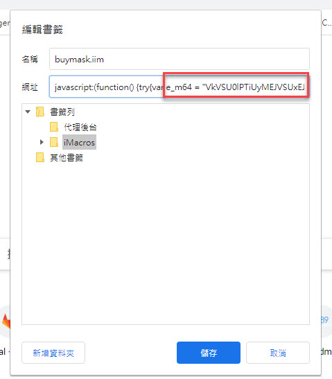

# Usage
* record macro through imacro (chrome extension)
* save the macro as bookmark
* from the bookmark on the chrome browser, right click the bookmark and click edit

* find `e_m64` value from the url
* replace `e_m64` value in launchMarco.html
* replace `filename` in launch.bat
* open `工作排程器`, create a basic task to run launch.bat